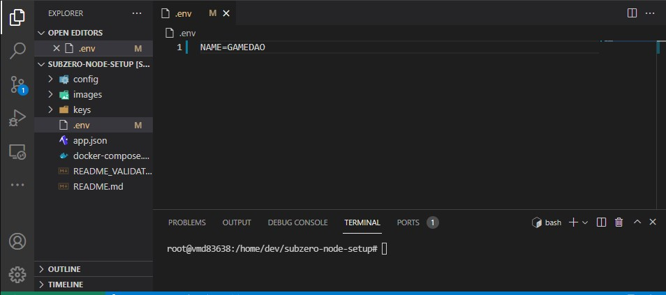
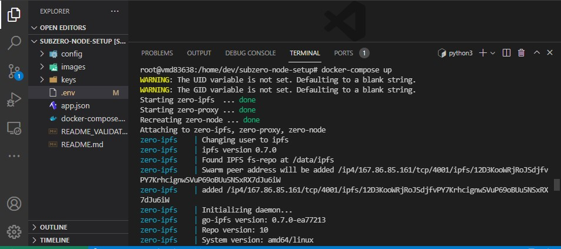
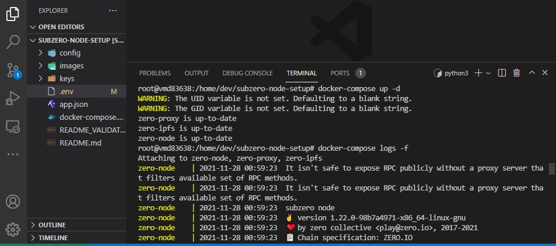
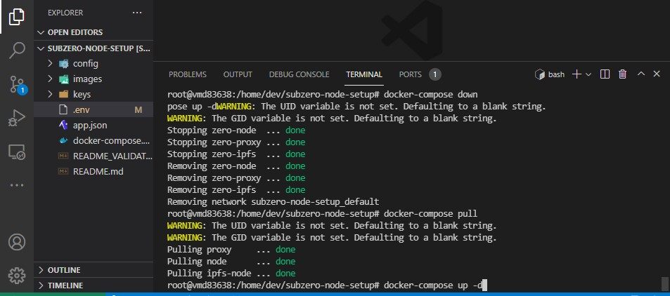

# zero.io
<p> 🛠️ alphaville testnet-node setup tutorial </p>

    Time: 5 min
    Difficulty: medium
    Required: light terminal experience
    Goal: A Syncing Alphaville testnet-node!

You are hardcore? You are in it for the liong haul? Consider becoming a Validator:
[*Advanced Validator Tutorial*](README_VALIDATOR.md)

<br/>
<br/>

---
## 0 - Setup 
---

### DigitalOcean:
[Docker Droplet](https://marketplace.digitalocean.com/apps/docker)

### Contabo:
[Contabo Ubuntu Docker Image](https://contabo.com/de/vps/)

**continue at step 1**

---

### Other:
##### First we need to install the tools needed (git, docker & docker-compose):

## **docker & docker-compose**:

Linux
- [Docker Engine](https://docs.docker.com/engine/install/ubuntu/) & [docker-compose](https://docs.docker.com/compose/install/) & [postinstall](https://docs.docker.com/engine/install/linux-postinstall/)

Windows
- [Docker Desktop](https://hub.docker.com/editions/community/docker-ce-desktop-windows)

---

## **git**:
- [Linux](https://git-scm.com/download/linux) || [Mac](https://git-scm.com/download/mac) || [Windows](https://git-scm.com/download/win)

<br/>
<br/>

---
## 1 - Clone the repository:
---

```
git clone https://gitlab.com/zero.io/subzero-node-setup
```

<br/>
<br/>

---
## 2 - Naming your node:
---

There is a file named `.env` in the repository the content is quite manageable
This is the name that will show up in the telemetry

```
NAME=ExampleNode
```



<br/>
<br/>

---
## 3 - Testing the Node:
---

We can now easily start the node with: 
```
docker-compose up
```



Once we verified this works we can actually start the node for long term production:

<br/>
<br/>

---
## 4 - Running the Node in production:
---

With 
```
docker-compose up -d
``` 
the process runs in the background.
We can always open the logs with 
```
docker-compose logs -f
```
to stop the container:
```
docker-compose down
```



</br>
</br>

---
## 5 - Updating the Node:
---

```
docker-compose down
docker-compose pull
docker-compose up -d
```



---

## DONE 🎉🎉🎉